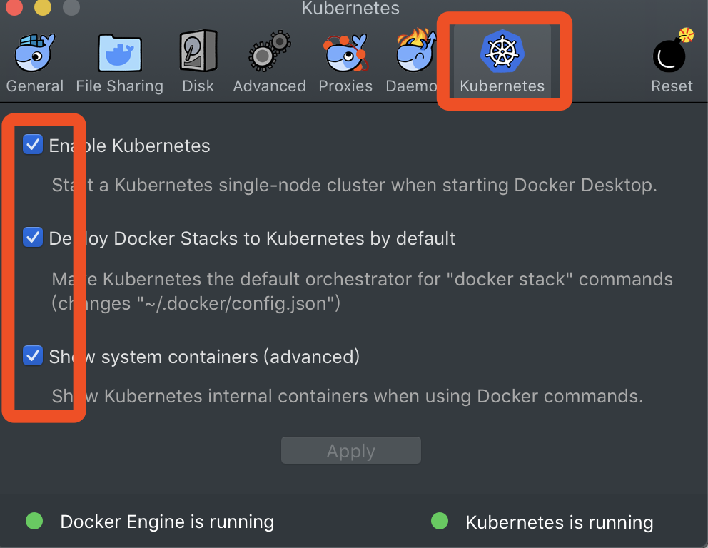

# 基于go-micro 的微服务开发并部署到k8s

MAC安装kubetnetes特别简单，首先下载 [Docker Desktop ](https://docs.docker.com/docker-for-mac/install/),最新版只需要在控制面板上选中kubetnetes 点击apply即可。



之后需要安装 kubetnetes 的控制工具：

```
brew install kubectl
```

## 编写服务

在go-micro中可以使用其它服务一样集成k8s。

```
package main

import (
	"github.com/lifei6671/micro-example/kafka"
	"github.com/micro/go-micro"
	k8s "github.com/micro/kubernetes/go/micro"
	"log"
)

func main() {
	//定义k8s创建服务
	service := k8s.NewService(
		micro.Name("go.micro.srv.kafka"),
	)

	// optionally setup command line usage
	service.Init()

	// 将自己实现的服务注册
	if err := kafka.RegisterKafkaProducerHandler(service.Server(), new(kafka.ProducerService)); err != nil {
		log.Fatalf("注册服务失败 ->%s", err)
	}

	// 启动服务
	if err := service.Run(); err != nil {
		log.Fatalf("user service error: %v\n", err)
	}
}
```

## 部署服务

以下是k8s部署微服务的示例，首先需要编写服务配置文件 deployment.yml ：

```
apiVersion: extensions/v1beta1
kind: Deployment
metadata:
  namespace: default
  name: grpc-service
spec:
  replicas: 1
  template:
    metadata:
      labels:
        app: grpc-service
    spec:
      containers:
        - name: grpc-service
          command: [
            "/grpc_service",
            "--server_name=grpc-service",
            "--server_address=0.0.0.0:10080",
            "--broker_address=0.0.0.0:10001",
            "--selector=static"
          ]
          image: lifei6671/grpc-service:latest
          imagePullPolicy: Always
          ports:
            - containerPort: 10080
              name: grpc-port
```

编写 Dockerfile 文件将程序打包成镜像：

```
# 若运行环境是 Linux 则需把 alpine 换成 debian
# 使用最新版 alpine 作为基础镜像
FROM alpine:latest

# 将微服务的服务端运行文件拷贝到 /app 下
ADD grpc_service /grpc_service

# 运行服务端
ENTRYPOINT [ "./grpc_service" ]
```

运行命令 `docker build . -t lifei6671/grpc-service:latest` 打包镜像。

编写k8s服务文件 service.yml：

```
apiVersion: v1
kind: Service
metadata:
  name: grpc-service
  labels:
    app: grpc-service
spec:
  ports:
    - port: 10080
      protocol: TCP

  type: NodePort
  selector:
    app: grpc-service
```

## 将服务部署到k8s上

```
kubectl create -f deployment.yml
kubectl create -f service.yml
```

查看服务是否部署成功：

```
kubectl get services
```
查看POD部署情况：

```
kubectl get pods
```

查看具体的 pod 执行日志：

```
kubectl logs grpc-service-5749f778d7-m7v56
```